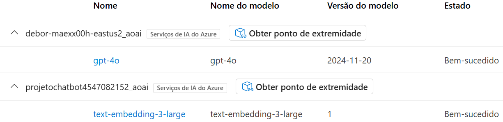
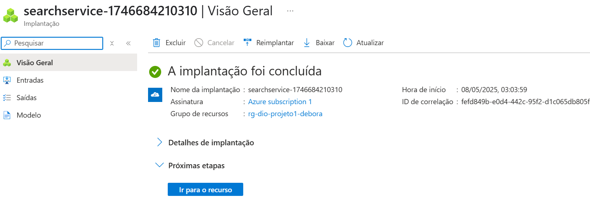
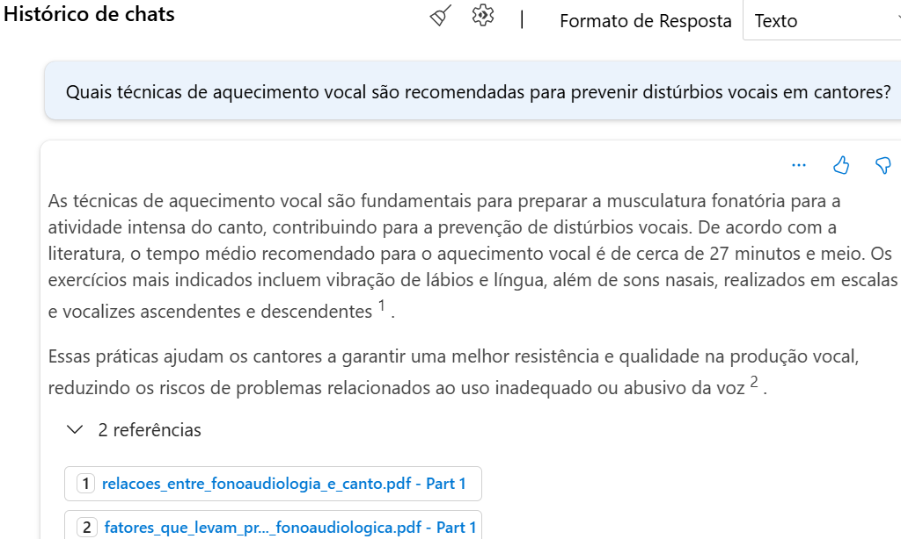
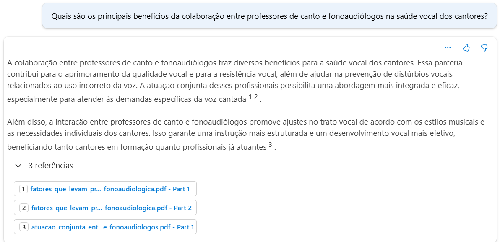

# 🤖 Desafio 2 - Criar Chatbot Baseado em Conteúdo de PDFs

## Proposta

Neste desafio, o objetivo é desenvolver um chatbot interativo no Azure Foundry, que utiliza conceitos como IA generativa, embeddings e buscas vetorizadas para que seja capaz de responder perguntas e encontrar conexões relevantes com base no conteúdo dos arquivos PDF ou documentos específicos enviados. Esta abordagem permite que seja criado um modelo personalizado de assistência virtual focado em um conjunto de informações proprietárias, sem depender unicamente do conhecimento geral de modelos pré-treinados.

## Casos de uso

Este chatbot pode ser relevante em casos específicos, como por exemplo, um aluno que quer encontrar conexões relavantes entre artigos cientificos para desenvolver seu TCC; ou um estudante que quer treinar para um concurso/prova a partir de materiais de estudo cspecíficos e fazer perguntas; criação de um chatbot específico para uma empresa que possa responder dúvidas de clientes  frequentes sobre um serviço/produto de uma empresa com base em documentos enviados, entre outros.

Para este estudo, foi escolhido o tema Fonoaudiologia e Canto.

# Chatbot Acadêmico com PDFs — Tema: Fonoaudiologia e Canto 🎶

## 🧾 Artigos Selecionados

### 1. [A Atuação conjunta entre professores de canto e fonoaudiólogos: uma revisão da literatura](https://periodicos.ufmg.br/index.php/permusi/article/view/5225)
Este artigo analisa a colaboração entre professores de canto e fonoaudiólogos, destacando a importância do trabalho interdisciplinar na saúde vocal dos cantores.

### 2. [INTER-RELAÇÕES ENTRE FONOAUDIOLOGIA E CANTO](https://revistas.ufg.br/musica/article/view/1758)
Explora as diferenças entre voz falada e cantada, enfatizando a importância de técnicas como aquecimento e desaquecimento vocais na prevenção de distúrbios vocais.

### 3. [Recursos terapêuticos utilizados na terapia vocal: uma revisão integrativa de literatura](https://revistas.pucsp.br/index.php/dic/article/view/66466)
Revisa os recursos terapêuticos empregados na terapia vocal, como tubo de ressonância e canudo de alta resistência, destacando sua eficácia na prática clínica.

### 4. [Principais fatores que levam os professores de canto popular a buscar ajuda fonoaudiológica](https://www.scielo.br/j/codas/a/xNh6Gkgc7FNXth9HqzZLgxk/)
Investiga os motivos que levam professores de canto a procurar apoio fonoaudiológico, ressaltando a importância do conhecimento em saúde vocal.

### 5. [Professor de canto, preparador vocal, fonoaudiólogo, otorrinolaringologista: limites e interseções da equipe de atendimento ao cantor](https://revista.ubm.br/index.php/revistacientifica/article/view/894)
Discute as especificidades e interseções entre os profissionais envolvidos no cuidado da voz cantada, promovendo uma abordagem integrada no atendimento ao cantor.

---

## ❓ Perguntas utilizadas para testes

1. **Quais são os principais benefícios da colaboração entre professores de canto e fonoaudiólogos na saúde vocal dos cantores?**

2. **Quais técnicas de aquecimento vocal são recomendadas para prevenir distúrbios vocais em cantores?**

3. **Quais recursos terapêuticos são mais utilizados na terapia vocal e qual sua eficácia?**

4. **Quais fatores levam professores de canto popular a buscar ajuda fonoaudiológica para seus alunos?**

5. **Como os diferentes profissionais (professor de canto, preparador vocal, fonoaudiólogo, otorrinolaringologista) colaboram no atendimento ao cantor?**

---

## 📚 Fontes dos Artigos

- Portal de Periódicos da UFMG  
- Revistas UFG  
- Revistas PUC-SP  
- SciELO Brasil  
- Revista UBM  

---

## Passo a passo do desenvolvimento

- Este projeto se iniciou com a criação de um grupo de recursos, com o objetivo de organizar e concentrar os serviços utilizados. Na sequência, foi estabelecido um hub juntamente com um projeto no Azure AI Foundry.

- Foi adotado o modelo de linguagem "gpt-4o" para lidar com as requisições e interpretar o conteúdo dos arquivos. Já para transformar os arquivos ".pdf" em vetores, optou-se pelo modelo "text-embedding-3-large", adequado para tarefas de similaridade e busca semântica.

- Em seguida, foi configurado o recurso "Azure AI Search", essencial para realizar a indexação e permitir buscas eficientes nos dados processados.

- Os arquivos em formato PDF que serviriam como base para as consultas foram carregados e vinculados ao recurso responsável por realizar a indexação do conteúdo.

- Foi fornecido um contexto e orientação específica ao modelo, e para validar sua atuação, foram utilizadas perguntas diretamente no chat. Isso permitiu observar a capacidade do sistema de correlacionar informações e referenciar conteúdos entre os documentos enviados como referência.

---

## ✨ Conclusão, Insights e Possibilidades Futuras

Este desafio proporcionou uma experiência prática muito enriquecedora, permitindo compreender como soluções baseadas em IA generativa podem ser aplicadas para resolver problemas reais, como a organização e extração de conhecimento a partir de grandes volumes de conteúdo técnico ou acadêmico.

Durante o desenvolvimento, foi possível perceber que:

- A integração entre **modelos de linguagem**, **embeddings vetoriais** e **ferramentas de busca semântica** oferece uma forma poderosa e eficiente de explorar documentos complexos.
- A utilização de **modelos específicos para embeddings**, como o `text-embedding-3-large`, contribui diretamente para a precisão das respostas fornecidas pelo chatbot.
- A criação de um **chat com base em documentos próprios** permite o desenvolvimento de assistentes virtuais altamente especializados em nichos específicos, como neste caso: fonoaudiologia e canto.

### Insights:

- O chatbot é capaz de conectar informações de múltiplos artigos de forma coerente, mesmo quando os dados estão distribuídos em diferentes fontes.
- Com perguntas bem elaboradas, é possível obter respostas profundas, contextualizadas e muito próximas do que seria uma curadoria feita manualmente por um especialista.
- A abordagem é facilmente escalável: bastaria adicionar novos PDFs ao sistema para expandir o conhecimento da IA, sem a necessidade de reprogramar ou treinar um modelo do zero.

### Possibilidades Futuras:

- Aplicações educacionais para cursos técnicos ou de graduação, com base em materiais didáticos personalizados.
- Criação de atendentes virtuais para empresas, treinados exclusivamente com manuais, FAQs e políticas internas.
- Desenvolvimento de ferramentas de apoio à pesquisa científica, facilitando a leitura e correlação de diversos estudos.

Este projeto demonstrou que, com as ferramentas certas, é possível transformar um conjunto de PDFs em um assistente inteligente e útil. A fusão entre IA e busca vetorial não apenas resolve problemas complexos de informação, como também abre portas para novas formas de interação com o conhecimento.
